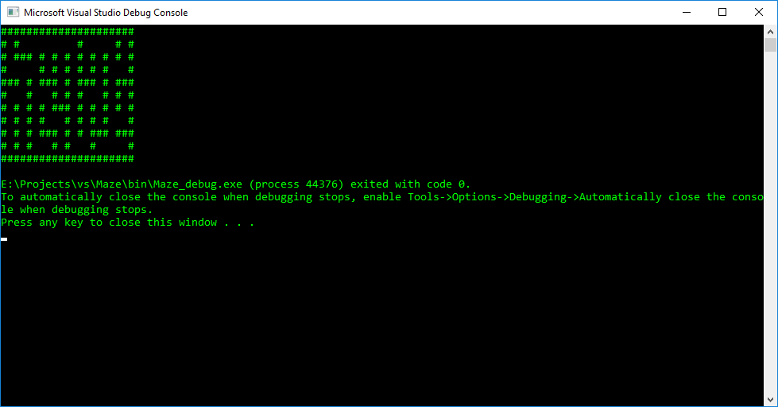
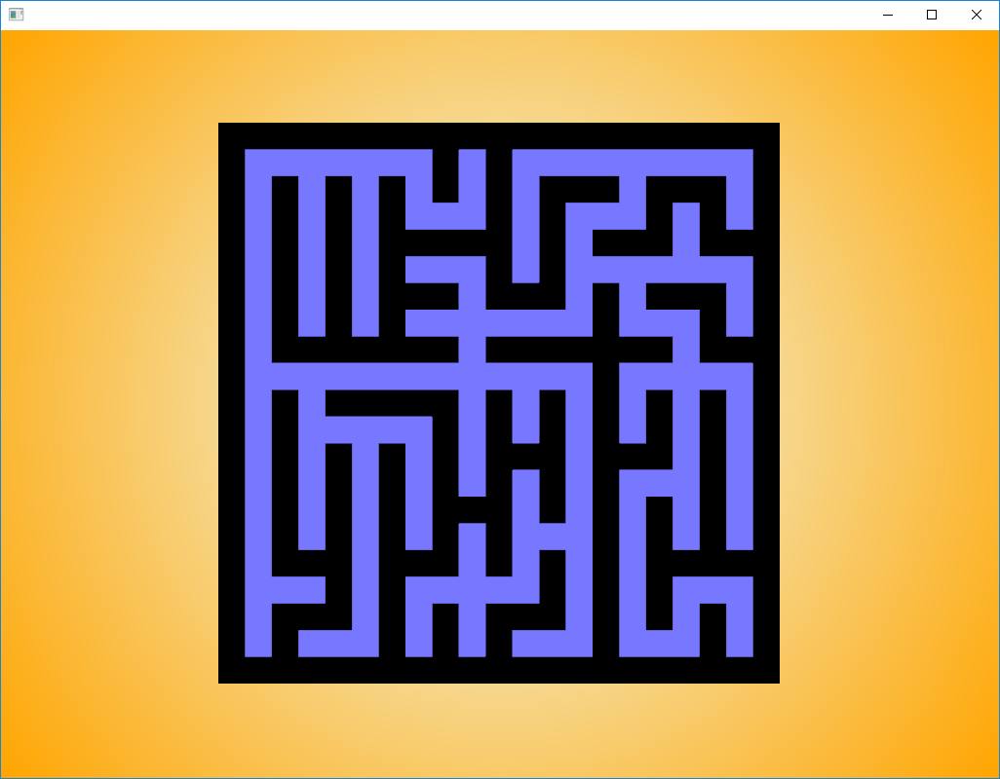
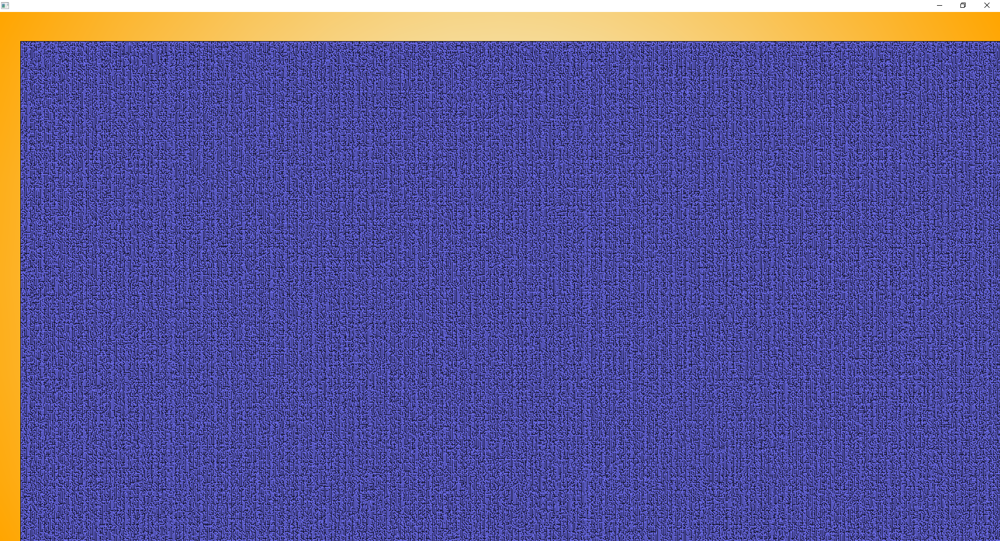
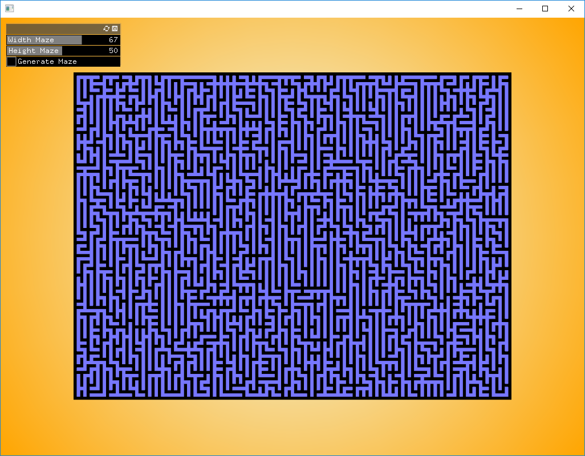
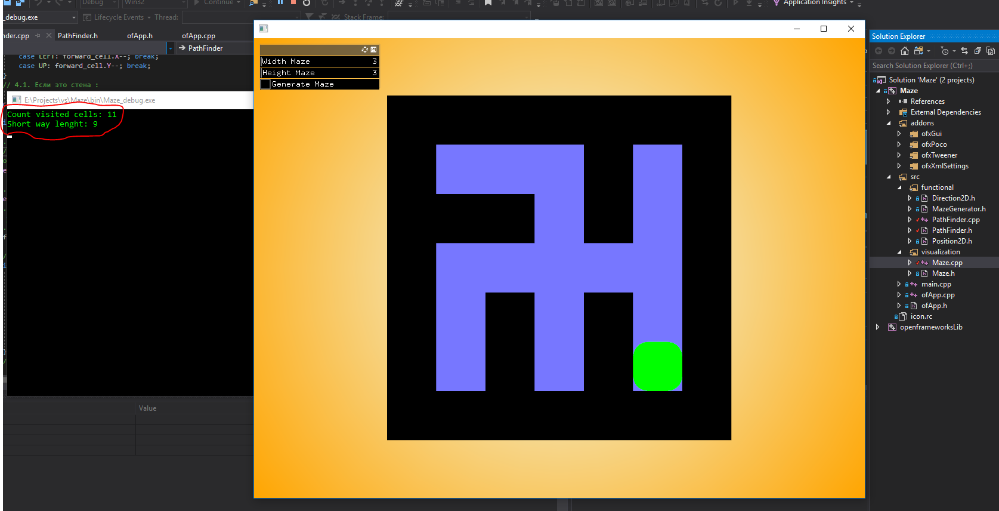

# Maze #

Любите ли вы проходить лабиринты так же как и я? Я очень любил рисовать ручкой путь из лабиринта в журналах «Мурзилка», но всегда сталкивался с тем, что периодически я заходил в тупики. И уже тогда я задумывался о том, что возможно есть какой-то универсальный способ нахождения выхода из лабиринта, чтобы не блуждать по одним и тем же закуткам по много-много раз. А есть ли способ найти кратчайший путь? Давайте попробуем разобраться.


Эта статья поможет разобраться с алгоритмом Эйлера для генерации односвязных лабиринтов и алгоритмом поиска кратчайшего пути из лабиринта. Реализация хоть и выполнена на C++ в контексте OpenFrameworks, но думаю не составит труда адаптировать её под любой объектно-ориентированный язык программирования. 

Для лучшего усвоения желательно знание основ алгоритмов и структур данных, а так же минимальныого понимания принципов наследования классов.


## Содержание ##

1. [Алгоритм Эйлера для генерации лабиринтов](#1-алгоритм-эйлера-для-генерации-лабиринтов)
   1. [Алгоритм](#11-алгоритм)
   1. [Реализация на C++](#12-реализация-на-c)
1. [Визуализация лабиринта и алгоритма поиска кратчайшего пути](#2-визуализация-лабиринта-и-алгоритма-поиска-кратчайшего-пути-на-openframeworks) на [openFrameworks](https://openframeworks.cc/)
   1. [Визуализация лабиринта](#21-визуализация-лабиринта)
   1. [Алгоритм поиска кратчайшего пути](#22-алгоритм-поиска-кратчайшего-пути)
   1. [Реализация алгоритма поиска кратчайшего пути на C++](#23-реализация-алгоритма-поиска-кратчайшего-пути-на-c)
   1. [Визуализация алгоритма поиска кратчайшего пути на OF](#24-визуализация-алгоритма-поиска-кратчайшего-пути-на-of)
1. [Заключение](#3-заключение)
1. [Используемая литература](#используемая-литература)

## 1. Алгоритм Эйлера для генерации лабиринтов ##

Для генерации лабиринта воспользуемся алгоритмом Эйлера для построения односвязного лабиринта. Термин «`односвязный` лабиринт» хорошо раскрывает в своей статье Джирл Уолкер:

> Этот термин означает, что лабиринт не содержит замкнутых маршрутов, т.е. таких, которые образуют замкнутую петлю. Замкнутый маршрут возникает в том случае, если существует ограниченный стенками «остров», который не соединяется с другими стенками лабиринта. Лабиринт с одним или более островами называется многосвязным. [[2]](http://ega-math.narod.ru/Nquant/Maze.htm)

### 1.1 Алгоритм ###

Примечание: условимся, что все левые ячейки лабиринта имеют левую стену, а все правые ячейки имеют правую стену.

1. Создайте первую строку лабиринта. Ни одна ячейка не будет принадлежать какому-либо множеству.
1. Присвоить каждой ячейке, которая не входит ни в одно множество, своё уникальное множество.
1. Создайте правые стены для ячеек, двигаясь слева направо, следующим образом:
   *  Случайным образом решите, добавлять стену или нет
       * Если текущая ячейка и ячейка справа являются членами одного и того же множества, всегда создавайте между ними стену (это предотвратит петли)
       * Если вы решите не добавлять стену, то объедините множества, к которым относятся текущая ячейка и ячейка справа
1. Создайте нижние стены, двигаясь слева направо:
   * Случайным образом решите, добавлять нижнюю стену или нет. *Важно:* Убедитесь, что каждая область имеет по крайней мере одну ячейку без нижней стены (это предотвратит создание изолированных областей)
       * Если ячейка является единственным членом своего множества, то не создавайте нижнюю стену
       * Если ячейка является единственным членом своего множества, которая не имеет нижней стены, то не создавайте нижнюю стену
1. Решите, продолжать добавлять строки или остановиться и завершить лабиринт
   * Если вы решите добавить еще одну строку:
       * скопируйте текущую строку
       * удалите в новой строку все правые стены
       * удалите ячейки с нижней стеной из их множества
       * удалите все нижние стены
       * продолжить с шага 2.
   * Если вы решили закончить лабиринт:
       * добавьте нижнюю стену каждой ячейке
       * перемещайтесь слева направо:
          * Если текущая ячейка и ячейка справа являются членами разных множеств, то:
             * удалить правую стену
             * объедините множества, к которым принадлежат текущая ячейка и ячейка справа
             * вывод итоговой строки

При первом прочтении алгоритм может показаться слегка запутанным. Для лучшего понимания разберем пример:

**Шаг 1. Создайте первую строку лабиринта**

Это будет просто пустая строка:
```
 ___ ___ ___ ___ ___ ___ ___ ___
|                               |
```

**Шаг 2. Присвоить каждой ячейке, которая не входит ни в одно множество, своё уникальное множество.**

```
 ___ ___ ___ ___ ___ ___ ___ ___
| 1   2   3   4   5   6   7   8 |
```

**Шаг 3. Создайте правые стены для ячеек, двигаясь слева направо**

```
 ___ ___ ___ ___ ___ ___ ___ ___
|(1   2)  3   4   5   6   7   8 |
```
Если мы решили не добавлять стену, объединим множества

```
 ___ ___ ___ ___ ___ ___ ___ ___
| 1  (1   3)  4   5   6   7   8 |
```

```
 ___ ___ ___ ___ ___ ___ ___ ___
| 1   1  (1   4)  5   6   7   8 |
```

```
    ...
 ___ ___ ___ ___ ___ ___ ___ ___
| 1   1   1 | 4   4 | 6   6   6 |
```

**Шаг 4. Создайте нижние стены, двигаясь слева направо**

Убедитесь, что каждая область имеет _по меньшей мере одну_ ячейку с нижним проходом (то есть без нижней стенки). Невыполнение этого требования приведет к изолированным областям.
```
 ___ ___ ___ ___ ___ ___ ___ ___
| 1  _1_ _1_| 4  _4_| 6   6  _6_|
```
**Шаг 5.А Если вы решите добавить еще одну строку**

* скопируйте текущую строку
```
 ___ ___ ___ ___ ___ ___ ___ ___
| 1  _1_ _1_| 4  _4_| 6   6  _6_|  <- строка закончена и имеет конечный вид
| 1  _1_ _1_| 4  _4_| 6   6  _6_|  <- скопированная строка, становиться текущей
```
* удалите в новой строку все правые стены
```
 ___ ___ ___ ___ ___ ___ ___ ___
| 1  _1_ _1_| 4  _4_| 6   6  _6_|
| 1  _1_ _1_  4  _4_  6   6  _6_|
```
* удалите ячейки с нижней стеной из их множества
```
 ___ ___ ___ ___ ___ ___ ___ ___
| 1  _1_ _1_| 4  _4_| 6   6  _6_|
| 1  ___ ___  4  ___  6   6  ___|
```
* удалите все нижние стены
```
 ___ ___ ___ ___ ___ ___ ___ ___
| 1  _1_ _1_| 4  _4_| 6   6  _6_|
| 1           4       6   6     |
```
* продолжить с шага 2.

_Шаг 2.  Присвоить каждой ячейке, которая не входит ни в одно множество, своё уникальное множество._

```
 ___ ___ ___ ___ ___ ___ ___ ___
|    ___ ___|    ___|        ___|
| 1   2   3   4   5   6   6   7 |
```
_Продолжая шаг 3. Добавьте правые стены_

```
 ___ ___ ___ ___ ___ ___ ___ ___
|    ___ ___|    ___|        ___|
|(1 | 2)  3   4   5   6   6   7 |  <- Добавлена стена
```

```
 ___ ___ ___ ___ ___ ___ ___ ___
|    ___ ___|    ___|        ___|
| 1 |(2   3)  4   5   6   6   7 |  <- Не добавлена стена, множества 2 и 3 объединяются в одно
```

```
 ___ ___ ___ ___ ___ ___ ___ ___
|    ___ ___|    ___|        ___|
| 1 | 2  (2   4)  5   6   6   7 |  <- Не добавлена стена, множества 2 и 4 объединяются в одно
```

```
 ___ ___ ___ ___ ___ ___ ___ ___
|    ___ ___|    ___|        ___|
| 1 | 2   2  (2 | 5)  6   6   7 |  <- Добавлена стена
```

```
 ___ ___ ___ ___ ___ ___ ___ ___
|    ___ ___|    ___|        ___|
| 1 | 2   2   2 |(5 | 6)  6   7 |  <- Добавлена стена
```

Следующие две ячейки являются членами одного множества, поэтому мы **должны** добавить стену. Невыполнение этого правила создает петли в нашем лабиринте.

```
 ___ ___ ___ ___ ___ ___ ___ ___
|    ___ ___|    ___|        ___|
| 1 | 2   2   2 | 5 |(6 | 6)  7 |  <- ДОЛЖНЫ добавить стену
```

```
 ___ ___ ___ ___ ___ ___ ___ ___
|    ___ ___|    ___|        ___|
| 1 | 2   2   2 | 5 | 6 |(6   7)|  <- Не добавлена стена, множества 6 и 7 объединяются в одно
```
_Продолжая шаг 4. Добавьте нижние стены_

```
 ___ ___ ___ ___ ___ ___ ___ ___
|    ___ ___|    ___|        ___|
| 1 | 2   2   2 | 5 | 6 | 6   6 |
```
Помните: по крайней мере одна ячейка из каждого набора должна иметь нижний проход (т.е. не должна иметь нижнюю стенку).

```
 ___ ___ ___ ___ ___ ___ ___ ___
|    ___ ___|    ___|        ___|
| 1 | 2  _2_ _2_| 5 |_6_| 6  _6_|
```
Вы можете добавить столько строк, сколько хотите.

```
 ___ ___ ___ ___ ___ ___ ___ ___
|    ___ ___|    ___|        ___|
|   |    ___ ___|   |___|    ___|
|_1_  1 | 3   3 | 7  _7_ _7_| 8 |
```

**Шаг 5.Б Если вы решили закончить лабиринт**

Последняя строка отличается от всех остальных двумя пунктами:
* Каждая ячейка имеет нижнюю стенку
* Все ячейки принадлежат одному и тому же множеству

Сделать каждую ячейку одного и того же набора просто. Просто удалите стены между ячейками, которые являются членами разных множеств, пока все ячейки не станут членами одного и того же множества. _Не удаляйте стену, если она разделяет две ячейки, которые являются членами одного и того же множества_

Начните с создания нормальной строки и добавьте нижнюю стенку в каждую ячейку
```
 ___ ___ ___ ___ ___ ___ ___ ___
|    ___ ___|    ___|        ___|
|   |    ___ ___|   |___|    ___|
|___    |       |    ___ ___|   |
|_1_ _1_|_3_|_3_|_7_ _7_ _7_|_8_|
```
Завершающим шагом нам необходимо удалить все стены между ячейками, которые принадлежат разным множествам
```
 ___ ___ ___ ___ ___ ___ ___ ___
|    ___ ___|    ___|        ___|
|   |    ___ ___|   |___|    ___|
|___    |       |    ___ ___|   |
|_1_ (1_|_3)|_3_|_7_ _7_ _7_|_8_|
```
```
 ___ ___ ___ ___ ___ ___ ___ ___
|    ___ ___|    ___|        ___|
|   |    ___ ___|   |___|    ___|
|___    |       |    ___ ___|   |
|_1_ _1_ _1_|(1_|_7) _7_ _7_|_8_|
```
```
 ___ ___ ___ ___ ___ ___ ___ ___
|    ___ ___|    ___|        ___|
|   |    ___ ___|   |___|    ___|
|___    |       |    ___ ___|   |
|_1_ _1_ _1_|_1_ _1_ _1_ (1_|_8)|
```
```
 ___ ___ ___ ___ ___ ___ ___ ___
|    ___ ___|    ___|        ___|
|   |    ___ ___|   |___|    ___|
|___    |       |    ___ ___|   |
|_1_ _1_ _1_|_1_ _1_ _1_ _1_ _1_|
```
Теперь у нас должен получиться полноценный односвязный лабиринт. Нет никаких зацикленных областей (чтобы существовал только один путь между любыми двумя ячейками), и никакие области не являются замкнутыми (изолированными от остальной части лабиринта). Вы можете назначить любые две ячейки входом и выходом.

```
 ___ ___ ___ ___ ___ ___ ___ ___
|    ___ ___|    ___|        ___|
|   |    ___ ___|   |___|    ___|
|___    |       |    ___ ___|   |
|___ ___ ___|___ ___ ___ ___ ___|
```

Ещё одним достоинством этого алгоритма является то, что можно сгенерировать лабиринт любых размеров.

Так же в данном алгоритме возможно изменять внешний вид лабиринта, добавив смещение к генератору случайных чисел, чтобы вероятность появления правой стенки была большей (или меньшей), чем вероятность появления нижней стенки. Например, вы можете создавать лабиринты с более длинными горизонтальными проходами, реже создавая правые стенки и чаще - стены снизу. Но в данном контексте мы оставим алгоритм таким, как он описан изначально и приступим к реализации этого алгоритма на C++.

### 1.2 Реализация на C++ ###

Для простоты понимания, основной функционал алгоритма мы напишем на C++ без привязки к каким-либо графическим библиотекам или движкам, чтобы этот код можно было легко переиспользовать в любом удобном для вас виде. Графическую оболочку мы добавим далее в этой статье.

Для начала создадим класс, который будет реализовывать этот алгоритм. Результат (наш сгенерированный лабиринт) будем возвращать в виде двумерного динамического массива. Для удобства воспользуемся стандартным контейнером `std::vector`. Назовем наш класс `MazeGenerator`. Пусть он будет содержать только один статический метод `generate(unsigned width, unsigned height)`, который будет возвращать указатель `shared_ptr` на матрицу с лабиринтом, представленную в виде `std::vector<std::vector<char>>`:

```C++
#pragma once
#include <vector>
#include <memory>

class MazeGenerator
{
public:
	static std::shared_ptr<std::vector<std::vector<char>>> generate(unsigned width, unsigned height);

private:
	MazeGenerator() { }
};
```

Результатом этого метода будет вектор с векторами из символов (матрица из символов), где:

* символом "` `"(пробел) является пустая ячейка; 
* символом "`#`"(решётка) - стена.

Так как одна ячейка массива может быть либо пустой, либо стеной, то для генерации стен справа и снизу мы условимся что ячейка в понятии алгоритма - в массиве будет являться областью 2x2, чем мы упростим (? или усложним) себе задачу по отображению лабиринта в дальнейшем. В области 2x2 каждая ячейка будет иметь свой символ:
* ячейка в левом верхнем углу области будет отображать значение ячейки из алгоритма (может быть как пустой ячейкой, так и стеной);
* ячейка в правом верхнем углу - стена справа (может быть как пустой ячейкой, так и стеной);
* ячейка в левом нижнем углу - стена снизу (может быть как пустой ячейкой, так и стеной);
* ячейка в правом нижнем углу - всегда будет стеной, или для понимания назовем её `опорой`. 

В связи с оговоренными условиями, сначала инициализируем размеры для векторов:

```C++
static std::shared_ptr<std::vector<std::vector<char>>> generate(unsigned width, unsigned height)
{
	// Проверим ограничения параметров на 0
	if ((width < 1) || (height < 1))
		return nullptr;

	auto top_limit = std::numeric_limits<unsigned>::max();
	// Проверим ограничения по максимальному допустимому размеру
	if (((top_limit - 1) / 2 <= width) || ((top_limit - 1) / 2 <= height))
		return nullptr;

	// Инициализируем размер конечной матрицы maze
	// Ячейки будут представлять из себя фрагменты 2x2 + 1 одно значение сверху и слева для стен
	unsigned output_height = height * 2 + 1;
	unsigned output_width = width * 2 + 1;
	// Инициализируем указатель на лабиринт
	auto maze = std::make_shared<std::vector<std::vector<char>>>();
	// Зарезервируем размер лабиринта по высоте
	maze.get()->reserve(output_height);

	// ...

	// вернем указатель на полученный лабиринт
	return maze;
}
```

После зарезервированного объема, инициализируем наш лабиринт начальными данными. Ограничим лабиринт по периметру стенами. Всю область лабиринта, за исключением верхней строки со стеной и левого столбца со стеной можно условно разделить на области 2x2. Изначально кроме стен по периметру - у каждой ячейки справа и снизу не будет стен. Но в каждой области 2x2 справа снизу установим стену, так как это не функциональная область, которая не рассматривается в алгоритме. У нас она всегда будет "опорой".

```C++
// Инициализируем построчно пустой лабиринт со стенами по периметру и "опорами" (стенами) в нижнем правом углу ячеек 2x2
// #######
// #     #
// # # # #
// #     #
// #######
for (unsigned i = 0; i < output_height; ++i)
{
	std::vector<char> row;
	row.reserve(output_width);
	for (unsigned j = 0; j < output_width; ++j)
		// Если этот элемент в строке является ячейкой в левом верхнем угле области 2x2 - то это пустая ячейка в лабиринте
		if ((i % 2 == 1) && (j % 2 == 1))
			row.push_back(' ');
		else
			// Если это область для стены справа или область для стены снизу - то инициализируем этот элемент пустой ячейкой в лабиринте
			if (((i % 2 == 1) && (j % 2 == 0) && (j != 0) && (j != output_width - 1)) ||
				((j % 2 == 1) && (i % 2 == 0) && (i != 0) && (i != output_height - 1)))
				row.push_back(' ');
			else 
				// Во всех остальных случаях устанавливаем стену
				row.push_back('#');
	maze.get()->push_back(std::move(row));
}
```

Теперь нам надо организовать цикл, к котором будут реализованы все шаги алгоритма. Т.к. высота лабиринта передается параметром, то достаточно использовать цикл `for`:

```C++
//1. Создайте первую строку лабиринта. Ни одна ячейка не будет принадлежать какому - либо множеству.
// Инициализируем вспомогательную строку, которая будет содержать в себе принадлежность ко множеству для ячейки из алгоритма
std::vector<unsigned> row_set;
row_set.reserve(width);
// 0 - будет означать, что ячейка не принадлежит никакому множеству
for (unsigned i = 0; i < width; ++i)
	row_set.push_back(0);
// И инициализируем счетчик для множеств
unsigned set = 1;
// Инициализируем генератор случайных чисел
std::random_device rd;
std::mt19937 mt(rd());
// от 0 до 2 (2 не входит) и после привидения к int будет либо 0 - где стены нет, либо 1 - стену решили установить
std::uniform_int_distribution<int> dist(0, 2);
// Организуем цикл алгоритма Эллера
for (unsigned i = 0; i < height; ++i)
{			
	//2. Присвоить каждой ячейке, которая не входит ни в одно множество, своё уникальное множество.
	//3. Создайте правые стены для ячеек, двигаясь слева направо, следующим образом :
	//	* Случайным образом решите, добавлять стену или нет
	//		* Если текущая ячейка и ячейка справа являются членами одного и того же множества, всегда создавайте между ними стену(это предотвратит петли)
	//		* Если вы решите не добавлять стену, то объедините множества, к которым относятся текущая ячейка и ячейка справа
	//4. Создайте нижние стены, двигаясь слева направо :
	//	* Случайным образом решите, добавлять нижнюю стену или нет. *Важно : *Убедитесь, что каждая область имеет по крайней мере одну ячейку без нижней стены(это предотвратит создание изолированных областей)
	//		* Если ячейка является единственным членом своего множества, то не создавайте нижнюю стену
	//		* Если ячейка является единственным членом своего множества, которая не имеет нижней стены, то не создавайте нижнюю стену
	//5. Решите, продолжать добавлять строки или остановиться и завершить лабиринт
	//	* Если вы решите добавить еще одну строку :
	//		* скопируйте текущую строку
	//		* удалите в новой строку все правые стены
	//		* удалите ячейки с нижней стеной из их множества
	//		* удалите все нижние стены
	//		* продолжить с шага 2.
}

//	* Если вы решили закончить лабиринт :
//		*добавьте нижнюю стену каждой ячейке
//		* перемещайтесь слева направо :
//			*Если текущая ячейка и ячейка справа являются членами разных множеств, то :
//			*удалить правую стену
//			* объедините множества, к которым принадлежат текущая ячейка и ячейка справа
//			* вывод итоговой строки

```

Теперь по шагам приступим к реализации:

```C++
//2. Присвоить каждой ячейке, которая не входит ни в одно множество, своё уникальное множество.
for (unsigned j = 0; j < width; ++j)
	if (row_set[j] == 0)
		row_set[j] = set++;
```

На 3ем шаге алгоритма выберем, с помощью генератора случайных чисел, будем мы добавлять стену или нет. Выполняя все условия шага 3 мы получим:

```C++
//3. Создайте правые стены для ячеек, двигаясь слева направо, следующим образом:
for (unsigned j = 0; j < width - 1; ++j)
{
    //  * Случайным образом решите, добавлять стену или нет
    const auto right_wall = dist(mt);
    //      * Если текущая ячейка и ячейка справа являются членами одного и того же множества, всегда создавайте между ними стену(это предотвратит петли)
    if ((right_wall == 1) || (row_set[j] == row_set[j + 1]))
        maze.get()->at(i * 2 + 1/*верхний ряд в i-ом ряду ячеек 2x2*/).at(j * 2 + 2/*Правый столбец в (i;j) ячейке 2x2*/) = '#';/*Создаем стену*/               
    else
    {
        //      * Если вы решите не добавлять стену, то объедините множества, к которым относятся текщая ячейка и ячейка справа
        const auto changing_set = row_set[j + 1];
        for (unsigned l = 0; l < width; ++l)
            if (row_set[l] == changing_set)
                row_set[l] = row_set[j];
    }
}
```

Аналогичным образом строим нижние стены:

```C++
//4. Создайте нижние стены, двигаясь слева направо:
for (unsigned j = 0; j < width; ++j)
{
    //  * Случайным образом решите, добавлять нижнюю стену или нет. 
    const auto bottom_wall = dist(mt);
    //      * Если ячейка является единственным членом своего множества, то не создавайте нижнюю стену
    unsigned int count_current_set = 0;
    for (unsigned l = 0; l < width; ++l)
        // считаем количество ячеек текущего множества
        if (row_set[j] == row_set[l])
            count_current_set++;
    //      * Если ячейка является единственным членом своего множества, которая не имеет нижней стены, то не создавайте нижнюю стену
    if ((bottom_wall == 1) && (count_current_set != 1))
        maze.get()->at(i * 2 + 2).at(j * 2 + 1) = '#';
}
```

Не забудем и про предупреждение в алгоритме. Необходимо убедиться, что, хотя бы одна ячейка из множества должна быть без нижней стены, чтобы предотвратить создание изолированных областей:

```C++
//*Важно: *Убедитесь, что каждая область имеет по крайней мере одну ячейку без нижней стены(это предотвратит создание изолированных областей)
// Только если это не последняя строка
if (i != height - 1)
{
    for (unsigned j = 0; j < width; ++j) {
        unsigned count_hole = 0;
        for (unsigned l = 0; l < width; ++l)
            if ((row_set[l] == row_set[j]) && (maze.get()->at(i * 2 + 2).at(l * 2 + 1) == ' '))
                count_hole++;
        if (count_hole == 0)
            maze.get()->at(i * 2 + 2).at(j * 2 + 1) = ' ';
    }
}
```

На 5ом шаге, если мы еще не дошли до последней строки лабиринта, то производим необходимые манипуляции с вектором множеств:

```C++
//5. Решите, продолжать добавлять строки или остановиться и завершить лабиринт
//  * Если вы решите добавить еще одну строку :
if (i != height - 1)
{
    //      * скопируйте текущую строку
    //      * удалите в новой строку все правые стены
    /// Правые стенки в инициализированном массиве у нас уже отсутствуют в каждой новой строке
    //      * удалите ячейки с нижней стеной из их множества
    for (unsigned j = 0; j < width; ++j)
        if (maze.get()->at(i * 2 + 2/* Проверим наличие нижней стены у текущего ряда*/).at(j * 2 + 1) == '#')
            // Если стенка есть, то удаляем ячейку из множества
            row_set[j] = 0;
    //      * удалите все нижние стены
    /// Нижние стены в каждом новом ряду ячеек отсутствуют (заложено при инициализации)
}
//      * продолжить с шага 2.
```

Цикл заканчивается и остался последний шаг 5.Б по завершению лабиринта. На данном этапе структура метода, примерно следующая:

```C++
static std::shared_ptr<std::vector<std::vector<char>>> generate(unsigned width, unsigned height)
{
    // Проверки
    // ...

    // Инициализация
    // ...
    
    //1. Создайте первую строку лабиринта.Ниодна ячейка не будет принадлежать какому - либо множеству.
    // ... реализация шага 1 ...

    // Организуем цикл алгоритма Эллера
    for (unsigned i = 0; i < height; ++i)
    {           
        //2. Присвоить каждой ячейке, которая не входит ни в одно множество, своё уникальное множество.
        // ... реализация шага 2 ...

        //3. Создайте правые стены для ячеек, двигаясь слева направо, следующим образом:
        // ... реализация шага 3 ...

        //4. Создайте нижние стены, двигаясь слева направо:
        // ... реализация шага 4 ...

        //5. Решите, продолжать добавлять строки или остановиться и завершить лабиринт
        // ... реализация шага 5.A
        //      * продолжить с шага 2.
    }

    // TODO: Осталось добавить реализацию завершения лабиринта.

    //  * Если вы решили закончить лабиринт :
    //      *добавьте нижнюю стену каждой ячейке
    //      * перемещайтесь слева направо:
    //          *Если текущая ячейка и ячейка справа являются членами разных множеств, то:
    //          *удалить правую стену
    //          * объедините множества, к которым принадлежат текущая ячейка и ячейка справа
    //          * вывод итоговой строки

    // вернем указатель на полученный лабиринт
    return maze;
}
```

Завершение алгоритма будет выглядеть следующим образом:

```C++
//	5.Б Если вы решили закончить лабиринт:
//		*добавьте нижнюю стену каждой ячейке
/// Нижняя стена построена при инициализации лабиринта
//		* перемещайтесь слева направо:
for (unsigned int j = 0; j < width - 1; ++j)
{
	//			*Если текущая ячейка и ячейка справа являются членами разных множеств, то :
	if (row_set[j] != row_set[j + 1])
		//			*удалить правую стену
		maze.get()->at(output_height - 2).at(j * 2 + 2) = ' ';
	//			* объедините множества, к которым принадлежат текущая ячейка и ячейка справа
		/// Это делать не обязательно, так как row_set мы больше не будем использовать,
		/// а все множества в конечном итоге станут одним, после удаления стен
	//			* вывод итоговой строки
}
```

Теперь, чтобы проверить работоспособность алгоритма, можем добавить метод в этот же класс для вывода сгенерированного лабиринта в консоль. На вход метод будет принимать указатель на лабиринт и построчно выводить его в консоль:

```C++
#pragma once
#include <vector>
#include <memory>
#include <random>

class MazeGenerator
{
public:
    static std::shared_ptr<std::vector<std::vector<char>>> generate(unsigned width, unsigned height)
    {
        // ... Алгоритм Эйлера для генерации лабиринта ...
    }

    static void print(const std::shared_ptr<std::vector<std::vector<char>>>& maze)
    {
        // Проверяем указатель на nullptr
        if (maze == nullptr)
            return;

        // Построчно считываем и выводим в консоль
        for (unsigned i = 0; i < maze.get()->size(); ++i)
        {
            for (unsigned j = 0; j < maze.get()->at(0).size(); ++j)
                std::cout << maze.get()->at(i).at(j);
            std::cout << std::endl;
        }
    }

private:
    MazeGenerator() = default;
};

```

И проверим как выглядит работоспособность алгоритма вызвав оба эти метода на примере лабиринта 10x5:

```C++
#include "MazeGenerator.h"

//========================================================================
int main( ){
    MazeGenerator::print(MazeGenerator::generate(10, 5));
    return 0;
}

```

А в результате выполнения этой программы вы увидите примерно следующее:
> 

Вроде выглядит уже неплохо. Замкнутых областей нету, как и нету "островов". Из-за межстрочного интервала в консоли, немного трудновато разглядеть все тонкости. Поэтому давайте реализуем графическую визуализацию.

## 2. Визуализация лабиринта и алгоритма поиска кратчайшего пути на [openFrameworks](https://openframeworks.cc/) ##

Для визуализации лабиринта и алгоритма поиска кратчайшего пути мы воспользуемся очень удобным и простым в освоении Фреймворком [openFrameworks](https://openframeworks.cc/), с основами которого вы можете ознакомиться на страничке [Learning](https://openframeworks.cc/learning/). Для демонстрации алгоритмов, описанных в этой статье, я постараюсь подробно описать процесс взаимодействия с OF (сокращенно от OpenFramworks). 

### 2.1 Визуализация лабиринта ###

Для начала необходимо сгенерировать проект на основе OF. Для этого:
* [Скачайте](https://openframeworks.cc/download/) и распакуйте архив с одной из последних версий OF, подходящей для вашей операционной системы и среды разработки, либо клонируйте репозиторий с сайта [GitHub](https://github.com/openframeworks/openFrameworks/). _Note: Версия c GitHub требует дополнительной настройки библиотек. Подробная инструкция есть так же в этом репозитории. Но для простоты, советую воспользоваться стабильной версией с офф.сайта._
* Помимо стандартных аддонов, которые идут в комплекте с OF, так же советую [клонировать мой fork для аддона Tweener](https://github.com/lpestl/ofxTweener) или скачать его [в оригинале с сайта-источника](https://github.com/hautetechnique/ofxTweener). _Но, насколько я помню, оригинал имеет проблемы с компиляцией из по Visual Studio, поэтому рекомендую воспользоваться моим форком._ Скачанный аддон положить в папку с `openFrameworks` и в подпапку `addons`, чтобы получилось что-то вроде `e:\Projects\openFrameworks\addons\ofxTweener\`. Для установки аддона - этого достаточно. Осталось только включить его в процессе генирации проекта.
* Для того чтобы сгенерировать новый проект на OF, необходимо запустить генератор проектов, который находиться по пути `%OF_PATH%\projectGenerator-vs\projectGenerator.exe`, конечно если вы используете VisualStudio. _В случае использования другой операционной системы и/или другой IDE, подробности по генерации проекта ищите на офф.сайте._ После запуска необходимо указать имя проекта (в моем случае это `Maze`), путь, где будет храниться этот проект, и подключить необходимые аддоны. Забегая вперед, я скажу, что, возможно, нам понадобятся `ofxPoco`(если такой имеется в наличии), `ofxTweener`, `ofxXmlSettings` и `ofxGui`(для быстрого и простого отображения пользовательского интерфейса). _Если каких-то аддонов у вас не хватает, вы можете [найти их на офф.сайте](http://ofxaddons.com/categories), скачать и положить в папку `%OF_PATH%\addons\`._ После всех манипуляций, нажмите кнопку Generate и проект будет создан и готов к компиляции. Осталось только его открыть в IDE. У меня окно генератора выглядело следующим образом:  

> 

После открытия проекта в VisualStudio, я добавил, уже написанный нами класс с генератором лабиринта, в папку `src/functional`. После я скомпилировал и запустил проект, чтобы проверить его работоспособность. Компиляция прошла без ошибок, я структура `Solution` выглядит следующим образом:

> 

Создадим дополнительную папку и фильтр в проекте с именем `visualization`. Добавим туда новый класс для визуализации лабиринта. Назовем его, например, `Maze` и оформим его по правилам используемого нами Фреймворка. Содержимое `Maze.h`:

```C++
// Maze.h
#pragma once

#include <vector>
#include <memory>

class Maze
{
public:
    // метод для инициализации начальных значений (аналог конструктора)
    void setup();
    // вызов метода происходит перед прорисовкой каждого кадра (предназначен для расчетов)
    void update();
    // метод для прорисовки кадра и отображения
    void draw();

    // метод, в котором мы будем просчитывать координаты и scale для лабиринта,
    // чтобы на следующем кадре он был отображен корректно по центру экрана
    void show_in_center();

    // Обработчики для событий самого приложения
    void windowResized(int w, int h);
    void keyPressed(int key);
    void keyReleased(int key);
    void mouseDragged(int x, int y, int button);
    void mousePressed(int x, int y, int button);
    void mouseReleased(int x, int y, int button);
    void mouseScrolled(int x, int y, float scrollX, float scrollY);

private:
    // Указатель на сгенерированный лабиринт
    std::shared_ptr<std::vector<std::vector<char>>> maze_;
    // Коэффициент увеличения для корректного отображения на экране
    float scale_ = 0;
    // Смещение всего лабиринта относительно левого верхнего угла экрана
    int pos_x_ = 0;
    int pos_y_ = 0;
    // Последние значения позиции мыши 
    // (понадобяться для того, чтобы в дальнейшем мы могли "двигать" мышкой лабиринт)
    int last_mouse_pos_x_ = 0;
    int last_mouse_pos_y_ = 0;
};
```

В методе `setup()` инициализируем лабиринт с помощью ранее написанного генератора. Для этого добавим `#include "MazeGenerator.h"`. Так же, для изначального отображения в центре экрана, после генерации лабиринта, вызовем метод `show_in_center()`, где подсчитаем масштаб и смещение лабиринта относительно текущего размера окна.

```C++
// Maze.cpp
#include "Maze.h"
#include "MazeGenerator.h"
#include "ofMesh.h"

void Maze::setup()
{
    // Если ранее лабиринт был уже создан
    if (maze_ != nullptr)
        // то сбрасываем счетчик указателя
        maze_.reset();
    // Генерируем новый лабиринт
    maze_ = MazeGenerator::generate(10, 10);
    // Нарисуем лабиринт в центре экрана
    show_in_center();
}

void Maze::show_in_center()
{
    // Проверяем, создан ли лабиринт
    if (maze_ == nullptr)
        return;
    // Получаем размеры окна
    auto w = ofGetWindowWidth();
    auto h = ofGetWindowHeight();
    // считаем коэффициент соотношения размеров окна к размерам матрицы по горизонтали и вертикали соответственно
    auto k = static_cast<float>(w) / maze_.get()->at(0).size();
    auto kh = static_cast<float>(h) / maze_.get()->size();
    // выбираем коэффициент в зависимости от того, какое соотношение меньше
    k = k < kh ? k : kh;
    // Масштаб возьмем равный 75% от размера экрана, чтобы изображение было не до самых краев
    scale_ = k * 0.75;
    // И сместим к центру в зависимости от масштаба
    pos_x_ = (w - maze_.get()->at(0).size() * scale_) / 2;
    pos_y_ = (h - maze_.get()->size() * scale_) / 2;
}
```

Для того чтобы нарисовать наш лабиринт, напишем в методе `draw()` логику отрисовки каждого кадра:

```C++
// Maze.cpp
// ...
void Maze::draw()
{
    // Проверяем, создан ли лабиринт
    if (maze_ == nullptr)
        return;
    // Запомним изначальную матрицу трансформирования сцены
    ofPushMatrix();
    // Сделаем сдвиг на подсчитанное смещение
    ofTranslate(pos_x_, pos_y_);
    // Увеличим размер конечного изображения на подсчитанный заранее масштаб
    ofScale(scale_, scale_);
    // Зададим общий фон ячеек прозрачным серо-голубым цветом
    ofSetHexColor(0x777777FF);
    // Нарисуем фон в виде прямоугольника
    ofDrawRectangle(0, 0, maze_.get()->at(0).size(), maze_.get()->size());
    // Зададим черный цвет для стен
    ofSetHexColor(0x000000);
    // И пробежим по массиву с лабиринтом
    for (size_t i = 0; i < maze_.get()->size(); ++i)
        for (size_t j = 0; j < maze_.get()->at(0).size(); j++)
            if (maze_.get()->at(i).at(j) == '#')
                // Отрисовывая при этом стены
                ofDrawRectangle(j, i, 1, 1);
    // Вернем матрицу трансформирования сцены в изначальное состояние
    ofPopMatrix();
}
// ...
```

Добавим небольшой интерактив для просмотра нашего лабиринта. Добавим перерисовку лабиринта при изменении размеров окна, добавим возможность скролла (приближения/удаления) к лабиринту, добавим возможность перемещать лабиринт мышкой.

```C++
// Maze.cpp
// ...

void Maze::windowResized(int w, int h)
{
	show_in_center();
}

void Maze::keyPressed(int key)
{
}

void Maze::keyReleased(int key)
{
}

void Maze::mouseDragged(int x, int y, int button)
{
	// При движении мыши с зажатой кнопкой, смещаем изображение на смещение мыши
	pos_x_ -= last_mouse_pos_x_ - x;
	pos_y_ -= last_mouse_pos_y_ - y;
	// И снова запоминаем расположение мыши
	mousePressed(x, y, button);
}

void Maze::mousePressed(int x, int y, int button)
{
	// Запоминаем расположение мыши при нажатии на кнопку
	last_mouse_pos_x_ = x;
	last_mouse_pos_y_ = y;
}

void Maze::mouseReleased(int x, int y, int button)
{
}

void Maze::mouseScrolled(int x, int y, float scrollX, float scrollY)
{
	// Если скролл отрицательный и уменьшение масштаба будет меньше единицы
	if ((scrollY < 0) && (scale_ * 0.9 <= 1.0))
		// То ничего не делаем
		return;
	// Иначе считаем разницу между позицией мыши и смещением лабиринта и делим на масштаб, чтобы определить смещение без масштаба
	auto deltaX = static_cast<double>(x - pos_x_) / scale_;
	auto deltaY = static_cast<double>(y - pos_y_) / scale_;
	// Масштаб увеличиваем в 10/9 в случае положительного скролла и в 0.9 в случае отрицательного
	scale_ *= scrollY < 0 ? 0.9 : 10.0 / 9.0;
	// Высчитываем смещение с новым масштабом
	pos_x_ = x - deltaX * scale_;
	pos_y_ = y - deltaY * scale_;
}

// ...
```

Теперь, чтобы это все скомпилировалось и запустилось, нам необходимо изменить класс `ofApp`, который и отвечает за отображение окна приложения. В `ofApp.h` мы добавим приватную переменную типа `Maze` и в `ofApp.cpp` пропишем обращение к ней во всех соответствующих методах.

```C++
// ofApp.h
#pragma once

#include "ofMain.h"
#include "visualization/Maze.h"

class ofApp : public ofBaseApp{

    public:
        void setup();
        void update();
        void draw();

        void keyPressed(int key);
        void keyReleased(int key);
        void mouseMoved(int x, int y );
        void mouseDragged(int x, int y, int button);
        void mousePressed(int x, int y, int button);
        void mouseReleased(int x, int y, int button);
        void mouseEntered(int x, int y);
        void mouseExited(int x, int y);
        void mouseScrolled(int x, int y, float scrollX, float scrollY);
        void windowResized(int w, int h);
        void dragEvent(ofDragInfo dragInfo);
        void gotMessage(ofMessage msg);

    private:
        Maze maze_;
};

// ofApp.cpp
#include "ofApp.h"
#include "MazeGenerator.h"

//--------------------------------------------------------------
void ofApp::setup(){
    maze_.setup();
}

//--------------------------------------------------------------
void ofApp::update(){
    maze_.update();
}

//--------------------------------------------------------------
void ofApp::draw(){
    // Изменим скучный серый фон на что-нибудь поинтересней
    ofBackgroundGradient(ofColor::azure, ofColor::orange);
    maze_.draw();
}

//--------------------------------------------------------------
void ofApp::keyPressed(int key){
    maze_.keyPressed(key);
}

//--------------------------------------------------------------
void ofApp::keyReleased(int key){
    maze_.keyReleased(key);
}

//--------------------------------------------------------------
void ofApp::mouseMoved(int x, int y ){

}

//--------------------------------------------------------------
void ofApp::mouseDragged(int x, int y, int button){
    maze_.mouseDragged(x, y, button);
}

//--------------------------------------------------------------
void ofApp::mousePressed(int x, int y, int button){
    maze_.mousePressed(x, y, button);
}

//--------------------------------------------------------------
void ofApp::mouseReleased(int x, int y, int button){
    maze_.mouseReleased(x, y, button);
}

//--------------------------------------------------------------
void ofApp::mouseEntered(int x, int y){

}

//--------------------------------------------------------------
void ofApp::mouseExited(int x, int y){

}

//--------------------------------------------------------------
void ofApp::mouseScrolled(int x, int y, float scrollX, float scrollY) {
    maze_.mouseScrolled(x, y, scrollX, scrollY);
}

//--------------------------------------------------------------
void ofApp::windowResized(int w, int h){
    maze_.windowResized(w, h);
}

//--------------------------------------------------------------
void ofApp::gotMessage(ofMessage msg){

}

//--------------------------------------------------------------
void ofApp::dragEvent(ofDragInfo dragInfo){ 

}
```

Примерно следующую картинку мы получим при запуске приложения:

> 

Смотрится лабиринт гораздо симпатичней чем в консоли, не правда ли? ;)

А примерно так выглядит приближенное начало сгенерированного лабиринта размером 1000x1000:

>

Теперь, чтобы лабиринт мы могли генерировать любого размера, давайте вынесем настройки ширины и длинны в пользовательский интерфейс. Для созданию своего UI, нам пришлось бы проделывать достаточно большую работу, поэтому воспользуемся доступным нам аддоном `ofxGui`. Для этого необходимо подключить в заголовке файла `ofApp.h` доступный файл `ofxGui.h` и добавить к приватным переменным UI панель, на которой будут располагаться элементы управления: два слайдера, для задания ширины и длинны, и кнопку для генерации лабиринта. A так же нам необходимо добавить три метода, для обработки событий с элементов управления слайдерами и кнопки. Выглядеть это будет следующим образом:

```C++
// ofApp.h
#pragma once

#include "ofMain.h"
#include "visualization/Maze.h"
#include "ofxGui.h"

class ofApp : public ofBaseApp {
	// ... Some methodts
		void widthMazeChanged(int &width);
		void heightMazeChanged(int &height);
		void generateMazeButtonClick();		
		// и еще необходим стандартный метод exit, который вызывается при закрытии окна,
		// чтобы мы имели возможность отписаться от событий с элементов управления
		void exit();

	private:
		Maze maze_;

		ofxPanel mazeUiPanel_;
		ofxIntSlider widthMaze_;
		ofxIntSlider heightMaze_;
		ofxButton generateMazeButton_;
};

```

В файле `ofApp.cpp` в методе `setup()` необходимо инициализировать элементы управления и добавить их на панель. В методе `draw()` нам необходимо отрисовать саму панель, а она уже отрисует все добавленные элементы управления. Причем, если мы хотим, чтобы панель была поверх всего, то и вызывать метод `draw()` у панели надо в последнюю очередь. В методе `exit()` мы отписываемся от событий. А в обработчике клика по кнопке, необходимо вызвать метод инициализации для нашего лабиринта с установленными на слайдерах значениями.

```C++
// ofApp.cpp
#include "ofApp.h"

//--------------------------------------------------------------
void ofApp::setup(){
	// Подписываемся на события элементов управления
	widthMaze_.addListener(this, &ofApp::widthMazeChanged);
	heightMaze_.addListener(this, &ofApp::heightMazeChanged);
	generateMazeButton_.addListener(this, &ofApp::generateMazeButtonClick);
	// Вызываем метод setup у панели
	mazeUiPanel_.setup();
	// И последовательно добавляем все элементы управления
	mazeUiPanel_.add(
		widthMaze_.setup("Width Maze" /* Подпись */,
			3/* Значение при старте */, 
			2 /* минимальное значение */, 
			100 /* максимальное значение */)
		);
	mazeUiPanel_.add(
		heightMaze_.setup("Height Maze" /* Подпись */, 
			3/* Значение при старте */, 
			2 /* минимальное значение */, 
			100 /* максимальное значение */)
		);
	mazeUiPanel_.add(generateMazeButton_.setup("Generate Maze" /* подпись */));

	maze_.setup();
}

//--------------------------------------------------------------
void ofApp::update(){
	maze_.update();
}

//--------------------------------------------------------------
void ofApp::draw(){
	ofBackgroundGradient(ofColor::azure, ofColor::orange);
	maze_.draw();

	// Рисуем панель поверх всего
	mazeUiPanel_.draw();
}

void ofApp::exit()
{
	// Отписываемся от событий
	heightMaze_.removeListener(this, &ofApp::heightMazeChanged);
	widthMaze_.removeListener(this, &ofApp::widthMazeChanged);
	generateMazeButton_.removeListener(this, &ofApp::generateMazeButtonClick);
}

void ofApp::widthMazeChanged(int& width)
{
}

void ofApp::heightMazeChanged(int& height)
{
}

void ofApp::generateMazeButtonClick()
{
	// Вызываем событи инициализации для лабиринта
	maze_.setup(widthMaze_, heightMaze_);
}
```

Но так как у нашего, написанного ранее класса `Maze`, метод `setup()` не принимает никаких параметров, то нам необходимо их добавить:

```C++
// Maze.h
#pragma once

#include <vector>
#include <memory>

class Maze
{
public:
	// метод для инициализации начальных занчений (аналог конструктора)
	void setup(int width, int height);
	// ...
}

// Maze.cpp
#include "Maze.h"
#include "MazeGenerator.h"
#include "ofMesh.h"
#include "ofBitmapFont.h"

void Maze::setup(int width, int height)
{
	// Если ранее лабиринт был уже создан
	if (maze_ != nullptr)
		// то сбрасываем счетчик указателя
		maze_.reset();
	// Генерируем новый лабиринт
	maze_ = MazeGenerator::generate(width, height);
	// Нарисуем лабиринт в центре экрана
	show_in_center();
}

// ofApp.cpp
// Ну и в методе ofApp::setup уберем первоначальную инициализацию для лабиринта,
// чтобы он генерировался не при старте приложения, а только по клику кнопки.
#include "ofApp.h"

//--------------------------------------------------------------
void ofApp::setup(){
	// Подписываемся на события элементов управления
	widthMaze_.addListener(this, &ofApp::widthMazeChanged);
	heightMaze_.addListener(this, &ofApp::heightMazeChanged);
	generateMazeButton_.addListener(this, &ofApp::generateMazeButtonClick);
	// Вызываем метод setup у панели
	mazeUiPanel_.setup();
	// И последовательно добавляем все элементы управления
	mazeUiPanel_.add(
		widthMaze_.setup("Width Maze" /* Подпись */,
			3/* Значение при старте */, 
			2 /* минимальное значение */, 
			100 /* максимальное значение */)
		);
	mazeUiPanel_.add(
		heightMaze_.setup("Height Maze" /* Подпись */, 
			3/* Значение при старте */, 
			2 /* минимальное значение */, 
			100 /* максимальное значение */)
		);
	mazeUiPanel_.add(generateMazeButton_.setup("Generate Maze" /* подпись */));

	//maze_.setup();
}
```

Теперь при запуске приложения мы можем выбирать размеры лабиринта в пределах от 2 до 100 включительно и генерировать его по клику кнопки.

>

### 2.2 Алгоритм поиска кратчайшего пути ### 

Для понимания некоторых моментов, советую ознакомиться со статьей Джирла Уолкера ["Как пройти через лабиринт не заблудившись"](http://ega-math.narod.ru/Nquant/Maze.htm). Описанных в этой статье основ достаточно, чтобы понять суть этого не сложного алгоритма.

Самое главное, что нужно знать, это то что в односвязном лабиринте к точке выхода ведет всегда только один путь. Еще один момент, который нужно учитывать, что добраться до выхода можно используя "Правило руки":

> ...Один из методов состоит в том, чтобы в каждой узловой точке выбирать одно и то же направление. Например, можно всегда сворачивать на крайнюю правую ветвь. Если этот путь закончится тупиком, следует вернуться к узловой точке и выбрать следующую ветвь (если считать справа). Может оказаться, что в результате вы пройдете по каждой ветви дважды — по одному разу в каждом направлении, но в конце концов вы доберётесь до цели. На обратном пути можно либо продолжать выбирать крайние правые ветви в каждом узле (и в этом случае вы, вероятно, пройдёте по новым областям лабиринта), либо каждый раз сворачивать на крайнюю левую ветвь (и тогда вы в точности повторите первоначальный маршрут). Метод выбора одной и той же — правой или левой — ветви я называю соответственно правилом правой или левой руки... [[2]](http://ega-math.narod.ru/Nquant/Maze.htm)

Исходя из этого мы можем "запоминать" уже посещенные ячейки. И если, поблуждав в каком-то тупике, мы возвращаемся на правильный маршрут, мы можем исключить все дважды посещенные точки из списка с посещёнными. Длинна этого списка, в конечном итоге, и будет являться длинной кратчайшего маршрута.

Для описания алгоритма введем такие абстрактные понятия как `игрок`, `точка входа` и `точка выхода`.

`Игрок` - это некоторая сущность, которая будет передвигаться по лабиринту от точки входа до точки выхода. Игрок будет иметь свои координаты нахождения в лабиринте и свое направление движения. Так же, для поиска кратчайшего пути, игроку потребуется какая-то история его передвижений, чтобы определять, был он уже в этой точке лабиринта, или не был.

`Точка входа` - позиция в лабиринте, с которой начинает свое движение игрок.

`Точка выхода` - местоположение, достигнув которого, игрок прекращает поиск.

Воспользуемся правилом левой руки.
Условимся, что точка входа не может быть и точкой выхода одновременно. При желании конечно можно реализовать и это, но для простоты оставим это фактом. Опишем алгоритм передвижения игрока от точки входа, до точки выхода:

1. Зададим начальную позицию и направление игрока.
1. Запоминаем координаты текущей ячейки, с учетом порядка посещения ячеек
1. Игрок поворачивается на 90 градусов **против часовой стрелки**
1. Игрок проверяет ячейку, которая находиться перед ним:
   1. Если это стена:
      * игрок поворачивается на 90 градусов **по часовой стрелке**
      * игрок повторяет _шаг 4_
   1. Если это свободная ячейка:
      * игрок выполняет _шаг 5_
1. Игрок переходит на новую свободную ячейку
1. По истории всех посещенных ранее ячеек, проверяем был игрок в этой новой ячейке или нет:
   1. Если игрок был в этой ячейке:
      * удаляем из истории посещенных ячеек все записи, начиная с последней, до координат текущей ячейки **включительно**
      * переходим к _шагу 7_
   1. Если игрок не был ранее в этой ячейке, то сразу переходим к _шагу 7_
1. Проверяем, является ли текущая ячейка `точкой выхода`:
   1. Если она не является `точкой выхода`, то повторяем с _шага 2_
   1. Если это `точка выхода`, то _заканчиваем алгоритм_.

Список посещенных точек, в порядке их посещения, включая текущую - является кратчайшим путем от `точки входа` до `точки выхода`.

Теперь приступим к реализации.

### 2.3 Реализация алгоритма поиска кратчайшего пути на C++ ###

Для удобства работы с координатами, добавим в папку `functional` файл `Position2D.h` в которой опишем структуру для хранения координат. 

```C++
// Position2D.h
#pragma once

struct Position2D
{
	unsigned X;
	unsigned Y;

	// Переопределим "operator < "
	// Это необходимо для дальнейшего использования этой структуры в качестве ключа для std::map
	bool operator < (const Position2D &p1) const
	{
		if (Y < p1.Y)
			return true;
		if (Y > p1.Y)
			return false;
		if (Y == p1.Y)
			return X < p1.X;
		return false;
	}
};

```

Еще добавим один файл для описания направления движения, который назовем `Direction2D.h`:

```C++
// Direction2D.h
#pragma once

enum Direction2D
{
	RIGHT,	// Направление НАПРАВО (или НА ВОСТОК)
	DOWN,	// Направление ВНИЗ (или НА ЮГ)
	LEFT,	// Направление ВЛЕВО (или НА ЗАПАД)
	UP,		// Направление ВВЕРХ (или НА СЕВЕР)
};
```

Добавим в ранее созданный проект в папку `functional` новый класс, который назовем `PathFinder`. И добавим в класс поля, которые будут реализовывать описанные выше вспомогательные части для понятия `игрок`.

```C++
// PathFinder.h
#pragma once

#include "Position2D.h"
#include "Direction2D.h"
#include <vector>
#include <map>
#include <memory>

class PathFinder
{
public:
	PathFinder();
	~PathFinder();
	// Метод для инициализации игрока
	void init(Position2D start_position, std::shared_ptr<std::vector<std::vector<char>>> maze);	
	// Метод для следующего шага игрока
	void nextStep();

	// Метод для получения количества посещенных ячеек лабиринта
	unsigned getCountVisitedCells() { return map_.size() + 1; }
	// Метод для получения длинны кратчайшего пути (в процессе поиска пути - он может быть не достоверный)
	unsigned getShortWayLenght() { return short_way_.size() + 1; }
	// Метод, чтобы спросить, добрался ли игрок до точки выхода
	bool isWin() { return is_win_; }

protected:
	bool is_win_;	// Флаг, который отображает, добрался ли игрок до точки выхода

	Position2D current_position_;							// Текущая позиция игрока
	Direction2D current_direction_;							// Текущее направление игрока

	std::map<Position2D, bool> map_;						// Все посещённые ячейки. Абстрактная "карта"
	std::vector<Position2D> short_way_;						// Вектор, который будет хранить координаты только кратчайшего пути
	
	std::shared_ptr<std::vector<std::vector<char>>> maze_;	// Указатель на лабиринт, по которому мы будем передвигаться
};
```

Давайте так же условимся, что для обозначения `точки выхода` мы модифицируем наш сгенерированный ранее лабиринт. Поставим точку выхода, например, в правом нижнем углу лабиринта и обозначим её как символ "`X`". А так же сразу в методе `setup` в файле `Maze.cpp` организуем цикл для проверки алгоритма поиска пути, пусть он даже пока и не реализован, но у нас уже есть интерфейс для работы с ним. Допишем в `setup` следующие строки:

```C++
// Maze.cpp
// #include ...
#include "PathFinder.h"

void Maze::setup(int width, int height)
{
	// Если ранее лабиринт был уже создан
	if (maze_ != nullptr)
		// то сбрасываем счетчик указателя
		maze_.reset();
	// Генерируем новый лабиринт
	maze_ = MazeGenerator::generate(width, height);

	// Добавим в лабиринт "точку выхода" в правый нижний угол учитывая наличие стен
	maze_.get()->at(maze_.get()->size() - 2).at(maze_.get()->at(0).size() - 2) = 'X';

	// Создадим "игрока", который будет искать точку выхода
	PathFinder player;
	// Зададим точку входа в левом верхнем углу лабиринта с учетом стен и передадим ему информацию о сгенерированном лабиринте
	player.init(Position2D{ 1, 1 }, maze_);
	// До тех пор пока игрок не достигнет цели
	while (!player.isWin())
		// игрок будет совершать шаги
		player.nextStep();
	// Выведем в консоль количество совершенных шагов
	std::cout << "Count visited cells: " << player.getCountVisitedCells() << std::endl;
	// И длинну кратчайшего пути
	std::cout << "Short way lenght: " << player.getShortWayLenght() << std::endl;

	// Нарисуем лабиринт в центре экрана
	show_in_center();
}
```

Ещё в этом же файле, для отображения точки выхода, допишем в методе `draw` отрисовку точки "`X`":

```C++

void Maze::draw()
{
	// ...
	// И пробещим по массивы с лабиринтом
	for (size_t i = 0; i < maze_.get()->size(); ++i)
		for (size_t j = 0; j < maze_.get()->at(0).size(); j++)
			if (maze_.get()->at(i).at(j) == '#')
				// Отрисовывая при этом стены
				ofDrawRectangle(j, i, 1, 1);
	// Проверим точку выхода
	if (maze_.get()->at(maze_.get()->size() - 2).at(maze_.get()->at(0).size() - 2) == 'X')
	{
		// Зададим Зеленый цвет
		ofSetHexColor(0xFF00FF00);
		// Нарисуем точку выхода
		ofDrawRectRounded(maze_.get()->at(0).size() - 2, maze_.get()->size() - 2, 1, 1, 0.3);
	}

	// Вернем матрицу трансформирования сцены в изначальное состояние
	ofPopMatrix();
}
```

Приложение пока не будем запускать, так как еще не реализована логика передвижения игрока и в этом методе приложение просто повиснет в бесконечном цикле `while`. Поэтому давайте теперь реализуем последовательно инициализацию для игрока и логику для совершения следующего шага.

```C++
// PathFinder.cpp
#include "PathFinder.h"

PathFinder::PathFinder() { }

PathFinder::~PathFinder() { }

void PathFinder::init(Position2D start_position, std::shared_ptr<std::vector<std::vector<char>>> maze)
{
	// Очищаем историю перемещений 
	map_.clear();
	short_way_.clear();
	// Заполучаем лабиринт для проверки каждого шага
	maze_ = maze;
	// На старте мы еще не нашли точку выхода
	is_win_ = false;
	// 1. Зададим начальную позицию и направление игрока.
	// Стартовая позиция будет задана в крайней ячейке левого верхнего угла лабиринта
	current_position_ = start_position;
	// А начальное направление пусть будет "направо" (на восток)
	current_direction_ = RIGHT;	
}

void PathFinder::nextStep()
{
	// Если мы уже добрались до точки выхода, то не имеет смысла делать дополнительные шаги
	if (is_win_) return;

	// 2. Запоминаем координаты текущей ячейки, с учетом порядка посещения ячеек
	map_[current_position_] = true;
	short_way_.push_back(current_position_);

	// 3. Игрок поворачивается на 90 градусов **против часовой стрелки**
	current_direction_ = current_direction_ == UP ? LEFT : current_direction_ == LEFT ? DOWN : current_direction_ == DOWN ? RIGHT : UP;
	// Инициализируем временную переменную для проверки впереди стоящей ячейки
	Position2D forward_cell;
	do {
		// 4. Игрок проверяет ячейку, которая находиться перед ним :
		forward_cell = current_position_;
		switch (current_direction_) 
		{ 
			case RIGHT: forward_cell.X++; break;
			case DOWN: forward_cell.Y++; break;
			case LEFT: forward_cell.X--; break;
			case UP: forward_cell.Y--; break;
		}
		// 4.1. Если это стена :
			// * игрок поворачивается на 90 градусов **по часовой стрелке**
		current_direction_ = current_direction_ == UP ? RIGHT : current_direction_ == LEFT ? UP : current_direction_ == DOWN ? LEFT : DOWN;
			// * игрок повторяет _шаг 4_
	} while (maze_.get()->at(forward_cell.Y).at(forward_cell.X) == '#');

	// 4.2. Если это свободная ячейка :
		// * игрок выполняет _шаг 5_
	// Востановим правильное направление
	current_direction_ = current_direction_ == UP ? LEFT : current_direction_ == LEFT ? DOWN : current_direction_ == DOWN ? RIGHT : UP;
	
	// 5. Игрок переходит на новую свободную ячейку
	current_position_ = forward_cell;
	// 6. По истории всех посещенных ранее ячеек, проверяем был игрок в этой новой ячейке или нет :
	auto foundedIter = map_.find(forward_cell);
	// 6.1. Если игрок был в этой ячейке :
	if (foundedIter != map_.end())
	{
		// * удаляем из истории посещенных ячеек все записи, начиная с последней, до координат текущей ячейки 
		if (!short_way_.empty()) {
			while ((!short_way_.empty()) && ((short_way_.back().X != foundedIter->first.X) || (short_way_.back().Y != foundedIter->first.Y)))
			{
				short_way_.erase(--short_way_.end());
			}
			// **включительно**
			if (!short_way_.empty()) {
				short_way_.erase(--short_way_.end());
			}
		}
		// * переходим к _шагу 7_
	}
	// 6.2. Если игрок не был ранее в этой ячейке, то сразу переходим к _шагу 7_
	// 7. Проверяем, является ли текущая ячейка `точкой выхода`:
	// 7.1. Если она не является `точкой выхода`, то повторяем с _шага 2_
	// 7.2. Если это `точка выхода`, то _заканчиваем алгоритм_.	
	is_win_ = maze_.get()->at(current_position_.Y).at(current_position_.X) == 'X';
}

```

После запуска приложения вы можете проверить на маленьком лабиринте, что алгоритм действительно правильно считает кратчайший путь и количество посещенных ячеек по методу "левой руки", если двигаться от левой верхней ячейки до выхода.

> 

Но это не наглядно. Давайте реализуем визуализацию для нашего алгоритма.

### 2.4 Визуализация алгоритма поиска кратчайшего пути на OF ###

Теперь вспомним немного о возможностях наследования и создадим класс для визуализации алгоритма поиска пути и назовем его, например, `ofPathFinder`. Пусть он будет храниться в папке `visualization` и повторять структуру OF. А так же пусть он будет дочерним классом от уже написанного нами `PathFinder`. Мы добавим ему не только отрисовку, но еще и анимированное плавное перемещение из одной точки в другую. Для этого добавим приватную переменную-флаг, которая будет фиксировать состояние отрисовки, т.е. анимирован он в данный момент или нет и еще один callback метод, который будет срабатывать в конце анимации. Добавим метод `void run()`, для запуска алгоритма. Изначально игрок будет появляться в начальной точке, а по команде - начинал свой путь. Так же нам понадобятся экранные координаты для отрисовки. Ведь, в родительском классе координаты позиции меняються моментально, а в процессе анимации экранные координаты будут меняться постепенно.

```C++
// ofPathFinder.h
#pragma once

#include "PathFinder.h"

class ofPathFinder : public PathFinder
{
public:
	void setup(Position2D start_position, std::shared_ptr<std::vector<std::vector<char>>> maze);
	void update();
	void draw();
	void run();

	void endAnimation(float *arg) { is_animated_ = false; }	// Callback функция, которая будет срабатывать, когда анимация заканчивается

private:
	bool is_animated_;	// Флаг для отслеживания состояния, находиться ли объект в процессе анимации (перемещения между ячейками)
	bool is_runed_;		// Флаг для отображения, запущен игрок или нет (в процессе ли он поиска)
	float screen_x_;	// Экранная координата X
	float screen_y_;	// Экранная координата Y
};

```

Для анимации мы ранее скачали и установили аддон `ofxTweener`. Сам аддон создает глобальную переменную `Tweener`, доступ к которой можно получить из любого места в проекте, просто подключив аддон с помощью диррективы `#include "ofxTweener.h"`. Чтобы он правильно пересчитывал все значения, на каждом тике `update` его надо обновлять, но только строго в одном месте, чтобы все анимации пересчитывались правильно. Можно добавить в файл `ofApp.cpp` следующие строки:

```C++
// ofApp.cpp
#include "ofApp.h"
#include "ofxTweener.h"		// аддон для анимаций

// ...

//--------------------------------------------------------------
void ofApp::update(){
	Tweener.update();	// обновление анимаций
	maze_.update();
}

// ...
```

Так же в классе `ofPathFinder` нам необходимо переопределить метод `nextStep()`, а для этого в базовом классе добавим в определении метода `virtual void nextStep();` и в классе `ofPathFinder` в разделе public добавим строку `void nextStep() override;`. 

Теперь реализуем методы для класса `ofPathFinder`. Надеюсь комментариев в коде будет достаточно.

```C++
// ofPathFinder.cpp
#include "ofPathFinder.h"
#include "ofxTweener.h"

void ofPathFinder::setup(Position2D start_position, std::shared_ptr<std::vector<std::vector<char>>> maze)
{
	// При первоначальной инициализации удалим все ранее запущенные анимации
	Tweener.removeAllTweens();
	is_animated_ = false;
	is_runed_ = false;
	// Запустим инициализацию базового класса
	init(start_position, maze);
	// Инициализируем начальные экранные координаты
	screen_x_ = current_position_.X;
	screen_y_ = current_position_.Y;
}

void ofPathFinder::update()
{
	// Если не запущен - то ничего не делаем
	if (!is_runed_) return;
	// Если запущен и уже добрался до конца - ничего не делаем
	if (is_win_) return;
	// Если еще не добрался до выхода, запущен и анимирован, то делаем следующий шаг
	if (!is_animated_)
		nextStep();
}

void ofPathFinder::draw()
{
	// Проверяем лабиринт
	if (maze_ == nullptr) return;	
	// Сначала серым закрасим все посещенные ранее ячейки
	ofSetHexColor(0x33555555);
	for (auto& pos : map_)
		ofDrawRectangle(pos.first.X, pos.first.Y, 1, 1);
	// Теперь зеленым отметим кратчайший путь
	ofSetHexColor(0x5500FF00);
	for (auto& pos : short_way_)
		ofDrawRectangle(pos.X, pos.Y, 1, 1);
	// И красным нарисуем самого "игрока"
	ofSetHexColor(0x77FF0000);
	ofDrawRectangle(screen_x_, screen_y_, 1, 1);
}

void ofPathFinder::run()
{
	// Запускаем игрока
	is_runed_ = true;
}

void ofPathFinder::nextStep()
{
	// Запоминаем текущие координты игрока
	screen_x_ = current_position_.X;
	screen_y_ = current_position_.Y;
	// Создаем callback, который будет вызываться при окончании анимации
	auto callback = std::bind(&ofPathFinder::endAnimation, this, std::placeholders::_1);
	// Вызывем базовый метод для выполнения следующего шага
	PathFinder::nextStep();
	// И анимируем перемещение игрока
	if (is_win_)
	{
		Tweener.addTween(screen_x_, static_cast<float>(current_position_.X), /* Длительность анимации */0.1F, &ofxTransitions::linear);
		Tweener.addTween(screen_y_, static_cast<float>(current_position_.Y), /* Длительность анимации */0.1F, &ofxTransitions::linear);
	} else
	{
		Tweener.addTween(screen_x_, static_cast<float>(current_position_.X), /* Длительность анимации */0.1F, &ofxTransitions::linear, callback);
		Tweener.addTween(screen_y_, static_cast<float>(current_position_.Y), /* Длительность анимации */0.1F, &ofxTransitions::linear, callback);
	}
}

```

Основной функционал прописан для визуализации, осталось только добавить его вызовы в класс `Maze`. Первым делом удалите часть кода из метода `setup()`, которая проверяла базовый класс `PathFinder` и выводила в консоль результат. В `Maze.h` добавьте объявление закрытой переменной класса `ofPathFinder` и добавьте публичный метод для запуска `void run()`.

```C++
// Maze.h
#pragma once

#include <vector>
#include <memory>
#include "ofPathFinder.h"

class Maze
{
public:
    // ...
	// Метод для запуска игрока
	void run() { player_.run(); }
	// ...
private:
	// ...
	// Игрок
	ofPathFinder player_;
};
```

В методах `setup`, `update` и `draw` в файле `Maze.cpp` так же необходимо внести изменения. А именно, в `setup` вызвать инициализацию игрока, в `update` - его обновление и в `draw` - нарисовать игрока и, в случае если он добрался до точки выхода, вывести информацию на экран.

```C++
// Maze.cpp
#include "Maze.h"
#include "MazeGenerator.h"
#include "ofMesh.h"
#include "ofBitmapFont.h"

void Maze::setup(int width, int height)
{
	// ...

	// Добавим в лабиринт "точку выхода" в правый нижний угол учитывая наличие стен
	maze_.get()->at(maze_.get()->size() - 2).at(maze_.get()->at(0).size() - 2) = 'X';
	
	// Инициализация игрока
	player_.setup(Position2D{ 1, 1 }, maze_);

	// Нарисуем лабиринт в центре экрана
	show_in_center();
}

void Maze::update()
{
	// Обновление 
	player_.update();
}

void Maze::draw()
{
	// ...

	// Отрисовка игрока (причем она должна быть до того как мы вызовем ofPopMatrix)
	player_.draw();

	// Вернем матрицу трансформирования сцены в изначальное состояние
	ofPopMatrix();

	// А сообщение о конце пути, выводим после ofPopMatrix
	if (player_.isWin())
	{
		std::stringstream reportStr;
		reportStr << "Short way FOUNDED! Need " << player_.getShortWayLenght() << " steps";
		ofDrawBitmapStringHighlight(reportStr.str(), 100, ofGetWindowHeight() - 100, ofColor::orangeRed, ofColor::black);
	}
}
// ...
```

Теперь только нехватает кнопки, чтобы запустить игрока. Для этого в `ofApp.h` добавим еще одну кнопу `ofxButton runPlayerButton_;` и метод для обработки события клика по этой кнопке `void runPlayerClick();`. А в файле `ofApp.cpp` в методе `setup` добавим обработчик события для этой кнопки и добавим её на панель. В методе `exit` отпишемся от этого события. А в методе `runPlayerClick` пропишем вызов запуска поиска пути.

```C++
// ofApp.h
#pragma once

#include // ..

class ofApp : public ofBaseApp{

	public:
		// ...
		void runPlayerClick();
		// ...
	private:
		// ...
		ofxButton runPlayerButton_;
};

// ofApp.cpp
#include "ofApp.h"
#include "ofxTweener.h"		// аддон для анимаций

//--------------------------------------------------------------
void ofApp::setup(){
	// Подписываемся на события элементов управления
	widthMaze_.addListener(this, &ofApp::widthMazeChanged);
	heightMaze_.addListener(this, &ofApp::heightMazeChanged);
	generateMazeButton_.addListener(this, &ofApp::generateMazeButtonClick);
	runPlayerButton_.addListener(this, &ofApp::runPlayerClick);
	// Вызываем метод setup у панели
	mazeUiPanel_.setup();
	// И последовательно добавляем все элементы управления
	mazeUiPanel_.add(widthMaze_.setup("Width Maze", 3, 2, 100));
	mazeUiPanel_.add(heightMaze_.setup("Height Maze", 3, 2, 100));
	mazeUiPanel_.add(generateMazeButton_.setup("Generate Maze"));
	mazeUiPanel_.add(runPlayerButton_.setup("Find short way"));
}
// ...
void ofApp::exit()
{
	// Отписываемся от событий
	heightMaze_.removeListener(this, &ofApp::heightMazeChanged);
	widthMaze_.removeListener(this, &ofApp::widthMazeChanged);
	generateMazeButton_.removeListener(this, &ofApp::generateMazeButtonClick);
	runPlayerButton_.removeListener(this, &ofApp::runPlayerClick);
}
// ...
void ofApp::runPlayerClick()
{
	maze_.run();
}
// ...
```

И теперь визуализация полностью готова. Если вы скомпилируете и запустите приложение, то увидите примерно следующую картину:

> 

Вот бы журнал "Мурзилка" с его лабиринтами можно было бы программировать)))

## 3. Заключение ##

Я хотел добавить еще несколько функциональных частей к нашему приложению, но статья получилась и так уже достаточно длинная. Я очень надеюсь, что несмотря на это, статья оказалась интересной и полезной. Я программирую на C++ только в качестве хобби, поэтому я буду рад всем замечаниям как к коду, так и к тексту статьи.

Написанное приложение без особых проблем можно собрать для Android, iOs, для Linux, Mac или Windows. Так же, приложив немного фантазии, можно сделать игру с управлением двумя игроками, например, из разных углов лабиринта к центру, либо на разделённом экране, либо при связи по блютуз или через интернет. Можно поупражняться в оформлении, добавить различных эффектов, particle systems, и/или различные бонусы, бусты, врагов.

Так же я надеюсь на ваш интерес и участие в этом проекте. Вот [ссылка на GitHub](https://github.com/lpestl/Maze). Ставьте звездочку, делайте fork и добавляйте ваши замечания и предложения в [issues](https://github.com/lpestl/Maze/issues) или по любому из указанных ниже контактов ;-)

И напоследок, небольшой челендж от меня. Я знаю как с небольшими изменениями в описанном проекте сделать 3D лабиринт в виде куба с разными слоями (этажами) для прохождения. А вы?)

## Используемая литература ##

1. [Eller's Algorithm](http://www.neocomputer.org/projects/eller.html)
1. [Как пройти через лабиринт не заблудившись. ДЖИРЛ УОЛКЕР](http://ega-math.narod.ru/Nquant/Maze.htm)
1. [openFrameworks learning](https://openframeworks.cc/learning/)

_______
### [lPestl](https://github.com/lpestl), специально для канала [UniLecs](https://t.me/unilecs) ###
```
	telegram: 	@lpestl
	skype: 		lp.e.s.tl
	E-mail:		lpestlname@gmail.com
```
